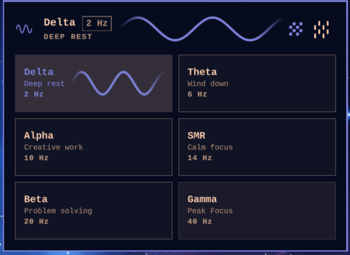

# Binaural — beats for the Omarchy bar



A minimal binaural beat suite, including options for brown noise or rain sounds with independent level controls.

Headphones are required: a binaural beat is the difference between the two
ears. The carrier is **110 Hz** (Gateway / Hemi-Sync range) and is not a
control.

## Presets

| Preset | Effect | Beat |
|---|---|---|
| Delta | Deep rest | 2 Hz |
| Theta | Wind down | 6 Hz |
| Alpha | Creative work | 10 Hz |
| SMR | Calm focus | 14 Hz |
| Beta | Problem solving | 20 Hz |
| Gamma | Peak Focus | 40 Hz |

Alpha is the default. The noise floor is on by default.

## The popup

Preset tiles start or stop **tones only** — rain and noise stay as you left
them. Noise and rain icons sit on the top-right: click to mute/unmute, drag
to change volume. Tone volume is the oscilloscope.

Brown noise is generated in-process; rain is a local loop of Moodist's
**Light Rain** sample (see `THIRD_PARTY.md`).

Right-click the bar icon to mute all three; right-click again restores the
same mix.

## Bar widget

| Action | Result |
|---|---|
| Left click | Open / close the popup |
| Right click | Mute all three / restore previous mix |

While playing, the bar shows the sine pair plus the preset name.

## Requirements

- Omarchy with the Quattro shell (`omarchy-shell`, Quickshell based).
- `python3` (standard library only) and `pw-play` (PipeWire) or `paplay`.
- `mpv` for the local rain loop.

No sudo.

## Install

Drop the folder in place (this repo is already a plugin directory):

```bash
# if you cloned it somewhere else:
cp -a . ~/.config/omarchy/plugins/callum.binaural
omarchy-restart-shell
omarchy plugin enable callum.binaural --section center
```

From git:

```bash
omarchy plugin add https://github.com/ClumZeez/omarchy-binaural --enable
```

## Remove

```bash
omarchy plugin remove callum.binaural
```

## Settings

Inline on the widget's entry in `~/.config/omarchy/shell.json`. The popup
writes these itself.

| Key | Default | Meaning |
|---|---|---|
| `preset` | `alpha` | Last chosen preset id |
| `noise` | `true` | Brown-noise floor preference |
| `rain` | `false` | Rain-bed preference |
| `volume` | `1` | Tone mix (oscilloscope), 0–1 |
| `noiseVolume` | `1` | Brown-noise level, 0–1 |
| `rainVolume` | `1` | Rain level, 0–1 |
| `masterVolume` | `1` | Master gain over all three, 0–1 |

## IPC

```bash
omarchy-shell binaural status
omarchy-shell binaural beat alpha     # tones only (beds unchanged)
omarchy-shell binaural stop           # stop tones + noise + rain
omarchy-shell binaural toggle         # mute all / restore (same as bar right-click)
omarchy-shell binaural noise          # toggle noise
omarchy-shell binaural noise on
omarchy-shell binaural noise off
omarchy-shell binaural rain           # toggle rain
omarchy-shell binaural rain on
omarchy-shell binaural rain off
omarchy-shell binaural volume 0.5     # master gain over tones + noise + rain
omarchy-shell shell toggle callum.binaural   # open / close the popup
```

Per-bed levels stay in the popup (oscilloscope / noise / rain scrubs).
`volume` on IPC is the master fader; it does not overwrite those scrubs.

## How it works

- `Service.qml` is the engine: one instance per shell, owns the tone
  generator and the local mpv rain loop, remembers preset and bed prefs.
- `BarWidget.qml` is the bar label and the popup, one per monitor.
- `SineIcon.qml` tints `assets/SineWave.svg` for the bar and the hero.
- `NoiseIcon.qml` / `RainIcon.qml` draw canvas marks (size follows volume
  while scrubbing).
- `VolumeScope.qml` / `Oscilloscope.qml` are the tone-volume control.
- `Beats.js` is the preset table and config parsing.
- `binaural` is a small Python generator. Left = 110 Hz, right = 110 Hz +
  beat. Optional uncorrelated brown noise in each ear. Fade in on start,
  fade out on stop. Live `PRESET` / `NOISE` / `NOISEVOL` / `VOLUME` /
  `TONES` / `STOP` on stdin.
- `rain-ipc` talks to mpv over a Unix socket for pause/volume.
- `assets/light-rain.mp3` is the rain bed (Moodist; see `THIRD_PARTY.md`).

## License

[MIT](LICENSE) © 2026 Callum Lees
